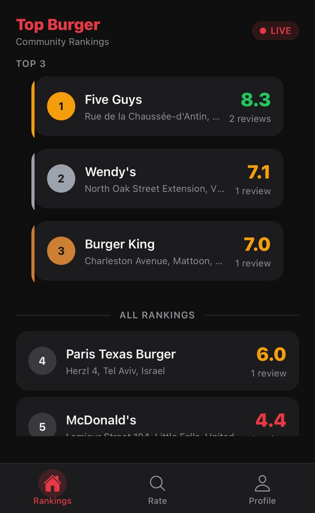
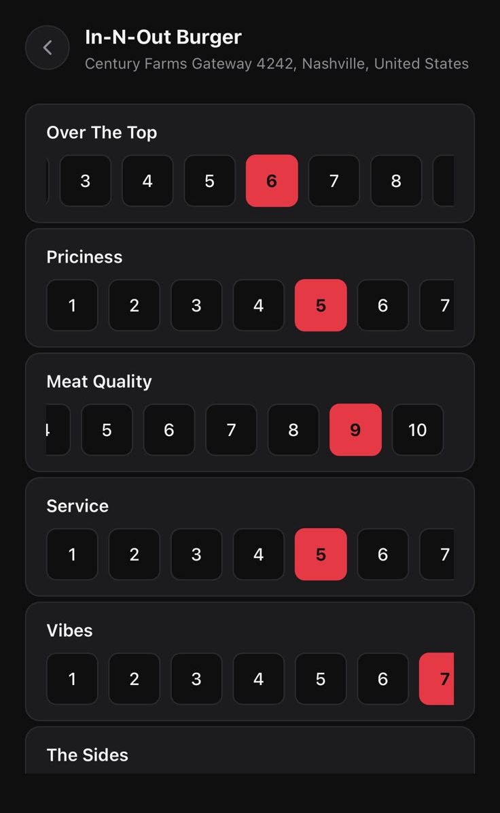
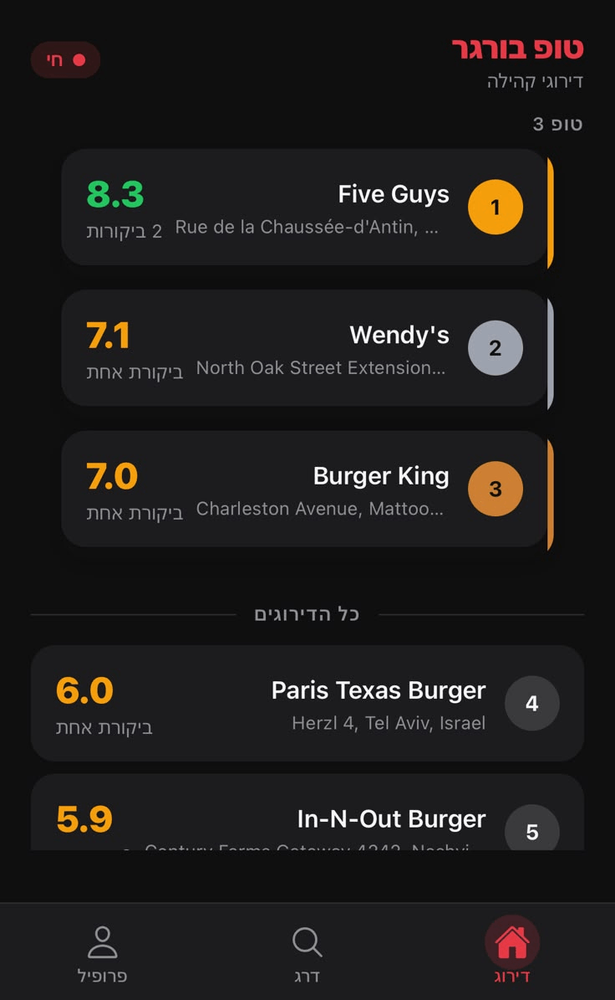

# 🍔 Top Burger

Rate burger joints anywhere in the world across 7 categories, tag the friends you ate with, and watch a live community leaderboard.

[](https://github.com/sagaga144/top-burger/actions/workflows/ci.yml)
[](LICENSE)


**Try it:** [top-burger-20976.web.app](https://top-burger-20976.web.app). It's an installable PWA; sign up with any email.

<p align="center">
  
  
  
  
</p>

One React Native + Expo codebase for iOS, Android and the web.

## Features

- **Global restaurant search** via [Photon](https://photon.komoot.io/) (OpenStreetMap), with a country filter and results in the UI language. No API key.
- **Manual entry** for places search can't find.
- **7-category rating.** *Over the Top, Priciness, Meat Quality, Service, Vibes, The Sides* and *After Effect*, each 1–10, averaged into one score.
- **Photo uploads** to Cloudinary, displayed at their real aspect ratio.
- **Eaten-with tagging.** Tag up to 5 friends and the review lands on every profile at once.
- **Live leaderboard and restaurant pages** through Firestore real-time subscriptions.
- **Profiles** with review history, editable usernames and deleting your own reviews.
- **English and Hebrew** with full RTL layout and in-app language switching.
- **Installable PWA** with iOS home-indicator safe-area handling.

## Engineering notes

- **Search without an API key.** Search started on Google Places (needs a billed API key), moved to Nominatim, and settled on Photon, an OpenStreetMap geocoder with multilingual results and no key. Photon can't filter by country server-side, so `lib/places.ts` over-fetches, filters on `countrycode`, and keeps only food amenities (`restaurant`, `fast_food`, …) when any match.
- **Cloudinary instead of Firebase Storage.** Storage requires the paid Blaze plan, so review photos go to Cloudinary through an unsigned upload preset. The whole backend stays on Firebase's free Spark plan.
- **Transactional score aggregates.** Restaurant and user averages are stored as running aggregates so the leaderboard is a single ordered query. Saving a review with tagged friends writes one review per participant and updates the restaurant and every participant's stats in one Firestore transaction, and deleting a review reverses it the same way. Security rules check every aggregate write, with the bounds below.
- **Full RTL i18n.** UI strings live in `locales/en.json` and `locales/he.json`, with i18next plurals. Native mirrors layout through `I18nManager.forceRTL` plus a restart. That call does nothing on the web, so the PWA sets `<html dir="rtl">` from i18next instead. Spacing uses logical start/end values (`ms-`/`me-`) rather than left/right, so the same styles mirror on both.
- **iOS PWA safe areas.** `useSafeAreaInsets()` returns 0 in an installed iOS PWA ([expo/expo#26011](https://github.com/expo/expo/issues/26011)), so the tab bar was clipped by the home indicator. It took eight commits over two days to fix. The final fix in `app/+html.tsx` pads `body` with CSS `env(safe-area-inset-*)`, enforces a 34px minimum in `display-mode: standalone` in case `env()` under-reports, and paints the strip in the tab-bar color with a background gradient instead of an overlay.

## Tech Stack

| Concern | Tech |
|---|---|
| Framework | React Native 0.81 + Expo SDK 54 |
| Routing | expo-router v6 (file-based) |
| Styling | NativeWind v4 (Tailwind for RN) |
| Backend | Firebase JS SDK v10: Firestore + Auth (email/password) |
| Search | Photon (OpenStreetMap) |
| Photos | Cloudinary (unsigned upload preset) |
| i18n | i18next / react-i18next |
| Language | TypeScript (strict) |
| Testing | Jest (jest-expo), `@firebase/rules-unit-testing` + Firestore emulator |
| CI / Hosting | GitHub Actions, Firebase Hosting |

## Project Structure

```
app/
├── _layout.tsx                    # Root stack + auth guard
├── +html.tsx                      # Web HTML shell (PWA safe-area CSS)
├── (auth)/login.tsx               # Sign in / sign up / password reset
├── (app)/
│   ├── _layout.tsx                # Tab bar (Rankings, Rate, Profile)
│   ├── index.tsx                  # Leaderboard
│   ├── search.tsx                 # Search + country filter + manual entry
│   ├── profile.tsx                # Profile + review history
│   ├── rate/[placeId].tsx         # 7-score rating + photo + tag friends
│   └── summary/[reviewId].tsx     # Review summary / delete
└── restaurant/[restaurantId].tsx  # All reviews for a place

lib/            # firebase, firestore (reads + transactional writes), scoring, places (Photon), i18n
components/     # RestaurantCard, ScoreSelector, PhotoUploader, CountryPickerModal, LanguageToggle
constants/      # Theme tokens, the 7 rating categories
locales/        # en.json, he.json
rules-tests/    # Firestore security rules tests (emulator)
scripts/        # One-off admin data migration
```

## Getting Started

You need Node.js, a Firebase project with Firestore and email/password Auth enabled, and a Cloudinary account with an unsigned upload preset.

```bash
npm install
cp .env.example .env    # fill in your Firebase and Cloudinary values
npm start               # Expo dev server (also: npm run ios / android / web)
```

| Script | What it runs |
|---|---|
| `npm test` | Jest unit tests (Firebase is mocked) |
| `npm run typecheck` | `tsc --noEmit` |
| `npm run test:rules` | Security rules tests against the Firestore emulator (needs the Firebase CLI and Java 21+) |

## Data Model (Firestore)

- **`restaurants/{placeId}`**: `name`, `address`, `reviewCount`, `averageScore`. Public read.
- **`reviews`**: one document per participant per rating session. Fields: `restaurantId`, `userId` (whose profile it's on), `authorId` (who wrote it), `userName`, `scores` (7 categories), `averageScore`, `photoUrl`, `photoAspectRatio`, `eatenWith` (participant uids), `createdAt`. Public read.
- **`users/{uid}`**: `displayName`, `displayNameLower` (prefix search), `totalReviews`, `averageScoreGiven`. Readable by signed-in users for friend search, so emails are never stored in Firestore.

### Security rules

[`firestore.rules`](firestore.rules) allows each write only for its purpose in the app, and [`rules-tests/`](rules-tests/firestore.rules.test.ts) checks both the app's real write paths and the abuse cases against the emulator.

- **Users.** You write only your own doc, with known fields only. No email, and `displayNameLower` must match `displayName`. Other users may change only your `totalReviews` and `averageScoreGiven`, and only by one review at a time. That happens when they tag you or delete a copy they tagged you on.
- **Reviews.** Created only with `authorId` equal to the signed-in user. Every participant must be listed in `eatenWith` (at most 6), and each copy's `userName` must match its owner's display name. Scores must be integers 1–10, a photo must be on Cloudinary, and the restaurant must exist. Only the author can edit a review, and never who or what it's about. The author or the tagged owner can delete it.
- **Restaurants.** Created only with exactly the expected fields. After that only `reviewCount` (−1, or +1 to +6) and `averageScore` (1–10) may change. A restaurant can be deleted only with its last review.

One limit: without Cloud Functions (Blaze plan), rules can't recompute an aggregate from the reviews behind it. A modified client could still nudge stats within those bounds.

## Deployment

The web build is a static export on Firebase Hosting. `dist/` is generated and not committed:

```bash
npx expo export --platform web   # builds dist/
firebase deploy --only hosting
firebase deploy --only firestore:rules
```

---

MIT © 2026 Sagi Tal · Developed with a Claude Code harness generated by claude-harness-bootstrap
